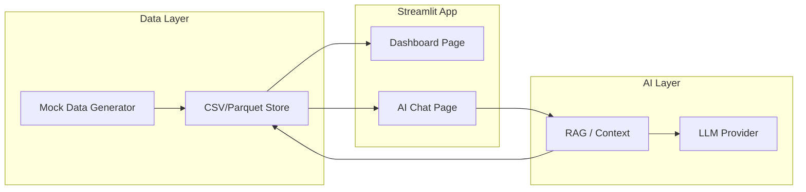
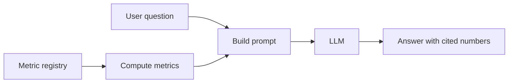

# Streamlit Dashboard + AI Chat — Project Plan

## 1. High-level architecture



- **Single Streamlit app**: multi-page (Dashboard + Chat) or single page with tabs/sidebar.
- **Data**: Generated once (or on demand) into `data/` (e.g. CSV/Parquet); app loads with caching.
- **AI Chat**: User asks questions -> app injects data context (schema, sample, or full small dataset) -> LLM returns answer; optional later: SQL generation or RAG over summarized stats.

---

## 2. GitHub repo structure

The **repository root is the project root**. Clone the repo and run all commands from that root. Suggested layout:

```
<repo_root>/
├── .github/
│   ├── workflows/              # CI (optional for MVP)
│   │   └── ci.yml              # Lint + pytest on push/PR
│   └── dependabot.yml         # Optional: bump deps
├── .env.example
├── .gitignore
├── LICENSE                     # MIT or your choice
├── README.md
├── requirements.txt
├── run_app.py                  # Entry: streamlit run run_app.py
├── data/
│   ├── raw/                    # Generated outputs (gitignore or commit sample)
│   │   └── mock_*.parquet
│   └── generate_data.py
├── docs/                       # Optional: design notes, runbooks
│   └── METRICS.md              # Metric definitions for humans
├── pages/
│   ├── 1_Dashboard.py
│   └── 2_AI_Chat.py
├── src/
│   ├── __init__.py
│   ├── data/
│   │   ├── __init__.py
│   │   ├── load.py
│   │   └── schema.py
│   ├── viz/
│   │   ├── __init__.py
│   │   └── charts.py
│   ├── chat/
│   │   ├── __init__.py
│   │   ├── context.py
│   │   └── ui.py
│   ├── llm/
│   │   ├── __init__.py
│   │   └── openai_client.py
│   └── metrics/                # Mini metrics layer (see §3)
│       ├── __init__.py
│       ├── definitions.py     # Registry: name, description, compute_fn
│       └── compute.py         # Run metrics over loaded data
├── tests/
│   ├── __init__.py
│   ├── test_load.py
│   └── test_metrics.py
```

- **`.gitignore`**: `.env`, `__pycache__/`, `*.pyc`, `.venv/`, `data/raw/*.parquet` (or allow a small `data/raw/sample.parquet` for CI/docs).
- **Branching**: `main` as default; optional `develop` or feature branches. No mandatory workflow until you add CI.
- **README**: State that the app runs from repo root and document clone, venv, `pip install -r requirements.txt`, `python data/generate_data.py`, `streamlit run run_app.py`.

---

## 3. Reducing insight hallucination

Goal: the model should only state **numbers and facts that come from the data or from pre-computed metrics**, not invent figures.

### Strategies (implement together)

1. **Strict prompting**
   - System prompt: "Answer only using the data context below. Do not infer or assume numbers not present. If the context does not contain enough information, say: 'I don't have that information in the data.'"
   - Reduces casual invention; does not alone prevent all hallucination.
2. **Compute-then-narrate (metrics layer)**
   - **Do not** ask the LLM to "calculate" from raw text. For key questions (totals, top N, comparisons), **compute in code** (pandas) and pass the **exact results** into the prompt.
   - Example: user asks "What was total revenue?" -> app runs metric `total_revenue` -> prompt includes "Total revenue (from data): $1,234,567" -> LLM only explains/interprets that number.
   - This is the main structural guard: numbers in answers come from the metrics layer, not from the model's weights.
3. **Mini custom metrics layer (recommended)**
   - **Yes, add a small metrics layer** for the data asset:
     - **Registry**: each metric has an id, description, and a **compute function** that takes the loaded DataFrame (and optional filters) and returns a scalar or a small table (e.g. top 10 rows).
     - **Single source of truth**: "revenue", "top_products_by_revenue", "revenue_by_region" are defined once in code; dashboard and chat both use these.
   - **Chat flow**: (a) User question -> optionally map to one or more metrics (by keyword/heuristic or a small LLM call that only picks metric IDs); (b) Run those metrics in code; (c) Inject **only** the computed results + schema/sample into the prompt; (d) LLM generates narrative from that.
   - **Benefit**: The model never "guesses" a number; it only describes pre-computed values. Reduces hallucination and keeps metrics consistent with the dashboard.
4. **Citation / evidence in the answer**
   - Ask the model to cite the source: e.g. "Based on [metric: total_revenue]" or "From the sample stats above." Optional: structured output with `answer` and `source` so the UI can show "Based on: total_revenue".
5. **Limit context to what's needed**
   - Send schema + summary stats + **pre-computed metric results** (and a small sample if helpful). Avoid dumping full tables so the model is less tempted to "fill in" from prior knowledge.
6. **Structured output (optional)**
   - Request JSON: `{"answer": "...", "metric_used": "total_revenue", "confidence": "high"}`. Use for validation or to show "Based on metric X" in the UI.

### Metrics layer scope (MVP)

- **Location**: `src/metrics/` (see §2).
- **Contents**: `definitions.py` (list of metrics: id, description, compute_fn); `compute.py` (`compute_metric(metric_id, df, **filters)` that runs the right function and returns a string or dict for the prompt).
- **Chat integration**: In `context.py`, extend context with "Pre-computed metrics (use only these numbers): ..." from `compute.py`. Optionally add a lightweight "question -> metric_id" step so only relevant metrics are computed and injected.
- **Dashboard**: Reuse the same metric compute functions for key numbers or tables on the dashboard so one definition drives both UI and AI.

### Flow with metrics layer



---

## 4. Key project decisions

| Decision | Choice | Rationale |
|---|---|---|
| **Data for MVP** | Synthetic dataset + script | No external DB; easy to version and share. Pick one domain (e.g. sales, product usage, or HR) and stick to it for coherent demos. |
| **Data format** | Parquet (primary) + optional CSV | Parquet: fast, compact, type-safe. CSV for quick inspection. |
| **Visualization** | Plotly (primary) + Altair for simple charts | Plotly: interactivity, dashboards. Altair: declarative, good for quick charts. |
| **AI provider** | **OpenAI** (recommended default) | Best docs, simple API, strong for instruction-following and optional tool use. Design with env-based config so you can swap to Anthropic/Azure later. |
| **AI context strategy** | Schema + summary stats + **pre-computed metrics** + sample | Numbers in answers come from the metrics layer; LLM only narrates. Reduces hallucination. |
| **Secrets** | `.env` + `python-dotenv`; keys in `st.secrets` for Streamlit Cloud | No keys in code; same app runs locally and on Streamlit Cloud. |
| **Project layout** | Repo root = project root; package-style `src/` | Full layout in §2 (includes `.github/`, `LICENSE`, `docs/`, `src/metrics/`). |

---

## 5. Recommended tech stack

- **Runtime**: Python 3.10+
- **App**: Streamlit
- **Data**: pandas, pyarrow (for Parquet)
- **Mock data**: Faker + custom logic, or a small script with explicit rows/columns
- **Viz**: Plotly, Altair
- **AI**: `openai` (default); abstract behind a thin `LLM` interface so you can add `anthropic` or `azure` later
- **Config / env**: `python-dotenv`, Streamlit `st.secrets`
- **Optional**: `langchain` or `llama-index` only if you later add RAG over many chunks; for MVP, "schema + stats + sample" is enough and keeps deps minimal.

---

## 6. Mock data asset (MVP)

- **Domain**: Sales (date, region, product, channel, quantity, unit_price, revenue, customer_name).
- **Generator** (`data/generate_data.py`):
  - Use **Faker** for names, dates, categories; add deterministic fields (e.g. revenue = quantity * price).
  - Output: Parquet file under `data/raw/`.
  - Script is idempotent (same seed -> same data) and documented in README.
- **Size**: 30k rows — enough for snappy visualizations and for the AI to reason about "top 10", "trends", "comparisons".

---

## 7. Dashboard (visualization)

- **Data loading**: In `src/data/load.py`, expose `get_sales_data()` with `@st.cache_data` on the Parquet read so the same asset is reused across pages.
- **Dashboard page** (`pages/1_Dashboard.py`):
  - Filters in sidebar: date range, region, product.
  - 3 KPI metrics from the metrics layer (total revenue, total orders, avg order value).
  - 4 charts: revenue over time, top products, revenue by region, price distribution.
  - Uses `src/viz/charts.py` for Plotly figures; `st.plotly_chart` for rendering.
- **No business logic in the page**: keep layout and filter logic in the page; computations and chart creation in `viz` and `metrics`.

---

## 8. AI Chat (insights and Q&A)

- **Context building** (`src/chat/context.py`):
  - **Schema**: table name, column names, types, short descriptions (from `schema.py`).
  - **Summary stats**: shape, date range, unique regions/products.
  - **Pre-computed metrics**: call `src/metrics/compute.py` for all metrics and append "Pre-computed metrics (use only these numbers): ..." to context. LLM must only cite these numbers.
  - **Sample**: first 15 rows as markdown table.
  - One function that returns a string to be injected into the system or user message.
- **LLM layer** (`src/llm/openai_client.py`):
  - Function `complete(context, user_message, **kwargs)` calling OpenAI Chat Completions; API key from env or `st.secrets`.
  - System prompt: "You are an analyst. Answer only from the provided data context and pre-computed metrics. Do not invent numbers. If something is not in the context, say so. Be concise."
  - User message: context string (including metrics) + "User question: ..."
- **Chat UI** (`src/chat/ui.py` + `pages/2_AI_Chat.py`):
  - `st.chat_message` / `st.chat_input`; messages stored in `st.session_state`.
  - On submit: build context (cached), optionally map question to metrics and compute them, append user message, call `complete()`, append assistant message.
  - Suggested questions tied to defined metrics (e.g. "What's the top product by revenue?") to guide users.
- **Provider swap**: Implement the same `complete(...)` interface in `src/llm/anthropic_client.py` (or Azure) and choose implementation via env (e.g. `LLM_PROVIDER=openai|anthropic`).

---

## 9. Configuration and secrets

- **`.env.example`**: `OPENAI_API_KEY=`, `LLM_PROVIDER=openai`, optional `DATA_PATH=./data/raw`.
- **`.gitignore`**: `.env`, `data/raw/*.parquet` (or commit a small sample if you prefer).
- **In app**: Prefer `st.secrets.get("OPENAI_API_KEY")` when available (e.g. Streamlit Cloud), else `os.getenv("OPENAI_API_KEY")` after loading dotenv.

---

## 10. Dependencies (requirements.txt)

- `streamlit`
- `pandas`
- `pyarrow`
- `plotly`
- `altair`
- `openai`
- `python-dotenv`
- `faker` (for mock data)

Version-pin minor (e.g. `streamlit>=1.28,<3`).

---

## 11. README and run instructions

- **README**: Project goal; how to create venv, install deps, set `.env`, run `python data/generate_data.py`, then `streamlit run run_app.py`; short description of Dashboard and AI Chat; how to add an API key for the chat.
- **Run**: `streamlit run run_app.py` (with app root as cwd so `data/` and `src/` resolve).

---

## 12. Optional later enhancements

- **RAG**: If the dataset grows or you add many tables, consider embedding chunks (e.g. "table X, columns A,B,C, sample stats") and retrieving before calling the LLM.
- **Generated SQL**: For a DB-backed version, add a step "generate SQL from question" and run it (with safeguards) instead of sending raw data.
- **Deploy**: Streamlit Community Cloud; connect repo, set secrets, point to `run_app.py`.
- **Tests**: Pytest for `load.py`, `context.py`, and LLM wrapper (with mocked client).

---

## 13. Summary

- **Repo**: Everything lives in one GitHub repo; repo root = project root. Full layout in §2 (including `.github/`, `LICENSE`, `docs/`, `src/metrics/`).
- **MVP data**: One mock sales dataset, generated with Faker into Parquet, loaded with caching.
- **Stack**: Streamlit, pandas, Plotly/Altair, OpenAI (recommended), thin LLM abstraction.
- **Dashboard**: One multipage app; Dashboard = filters + 4 Plotly charts; reuse metrics layer for KPI numbers.
- **Hallucination reduction**: Mini metrics layer (`src/metrics/`) so numbers are **computed in code** and only injected into the prompt; strict prompting; optional citation/structured output. Chat = compute-then-narrate.
- **Design**: Provider-agnostic LLM layer and env-based config so you can switch AI providers or move from mock data to a real DB later without rewriting the app.
